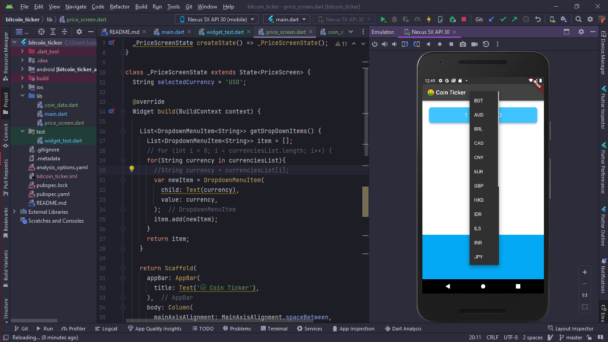
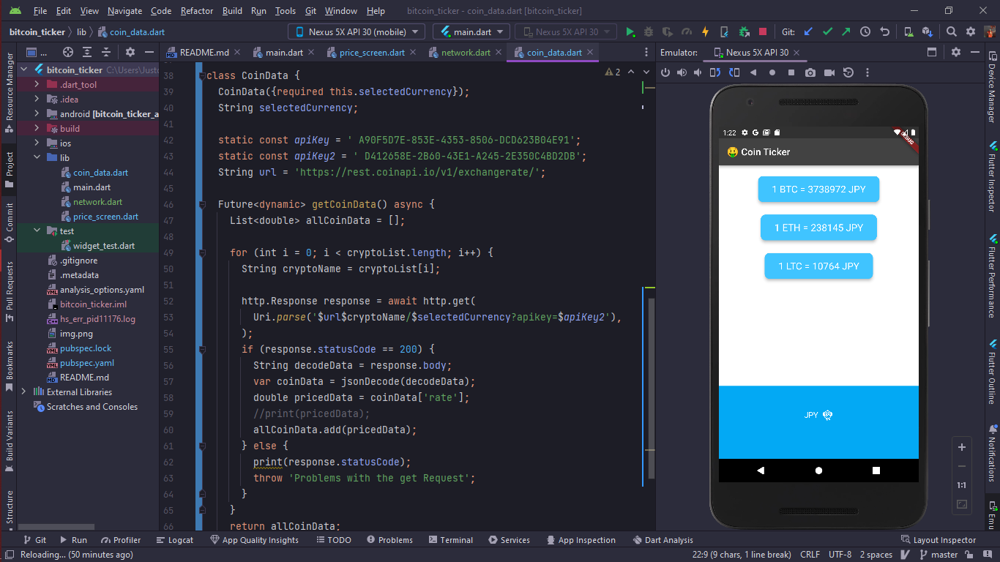
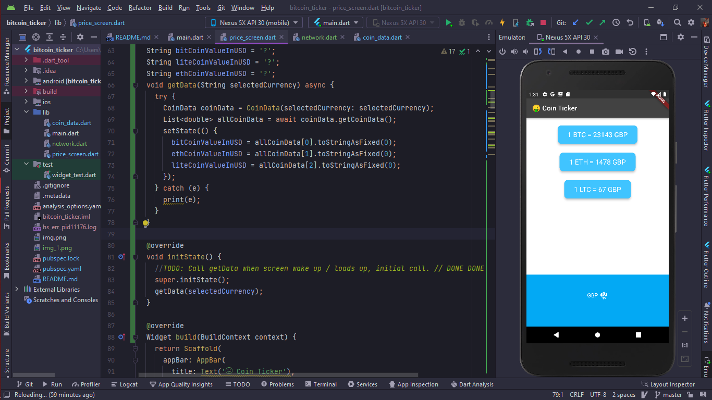

# bitcoin_ticker

A Bitcoin Ticker  Flutter project.

## Getting Started

This project is a starting point for a Flutter application.

update: add DropDownMenuItem and managed it with for loops for showing currency we have

added all functionality for converting any Coin to any currencies own value, and show up in one single screen, managed state perfectly.

